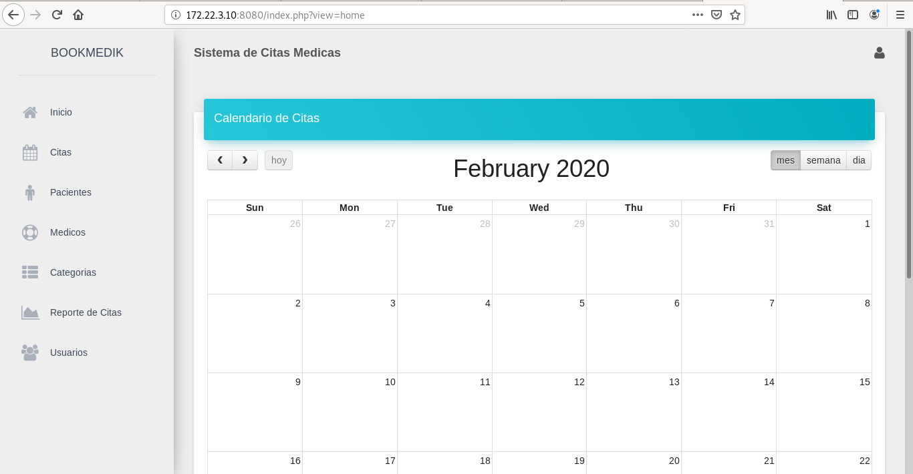
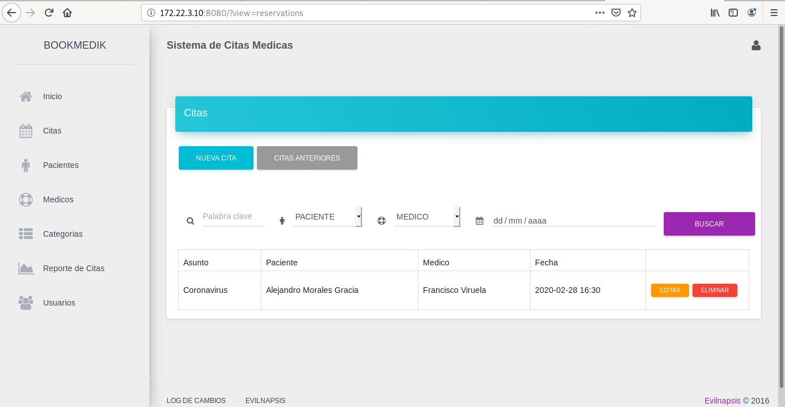
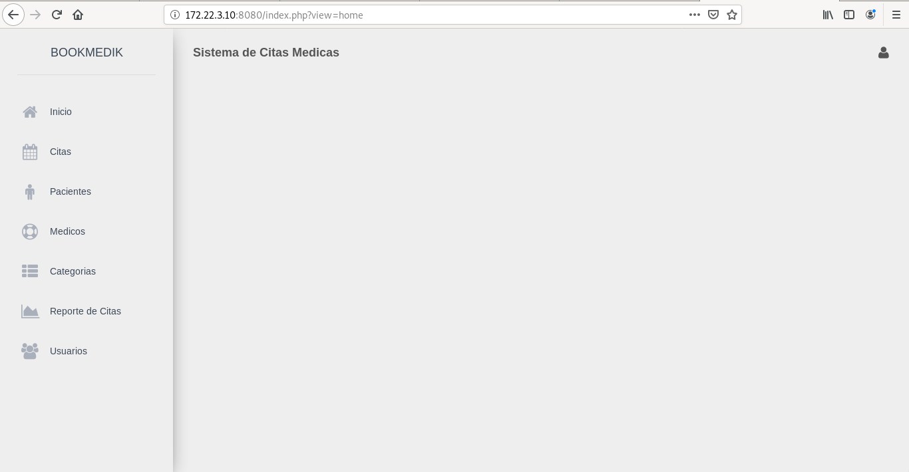
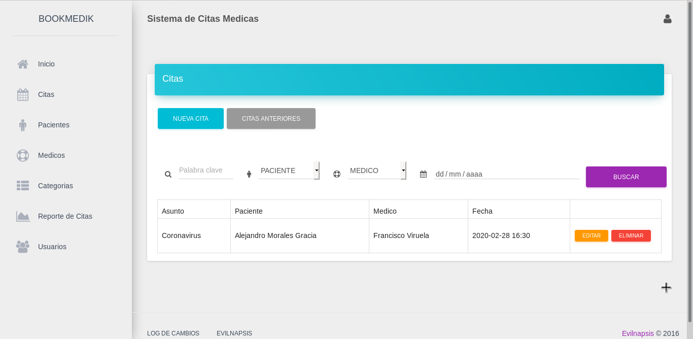
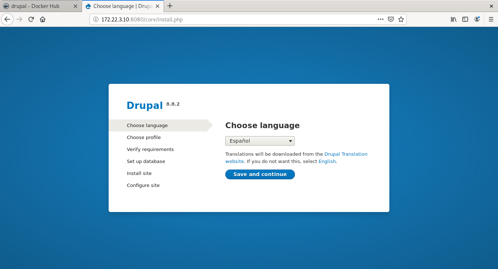
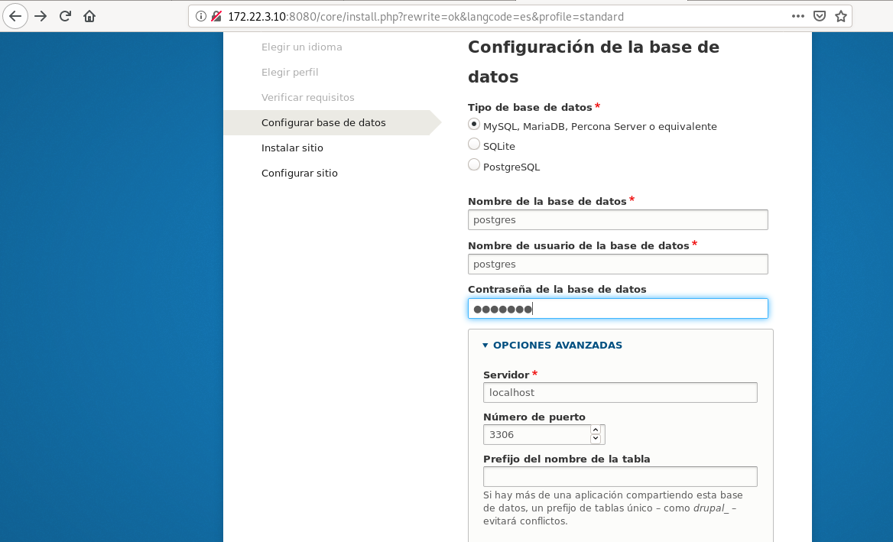
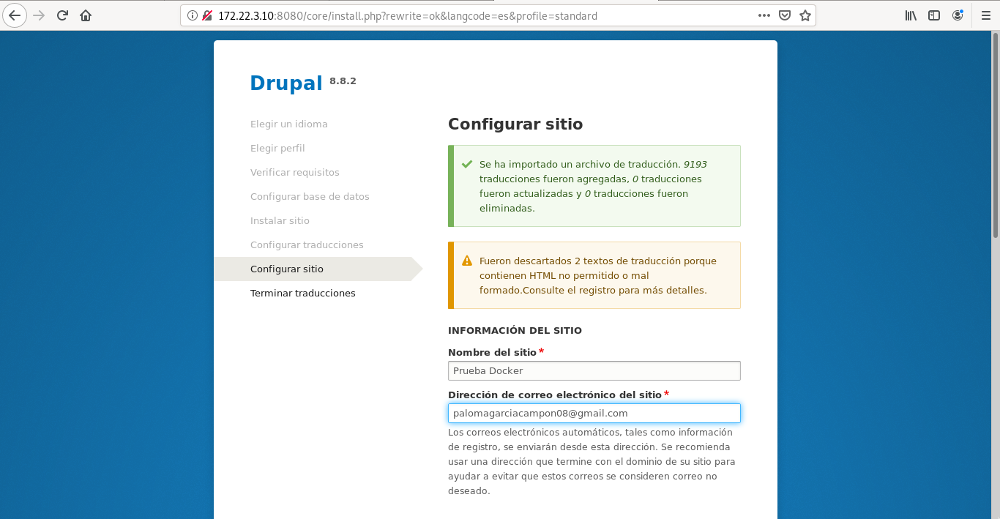
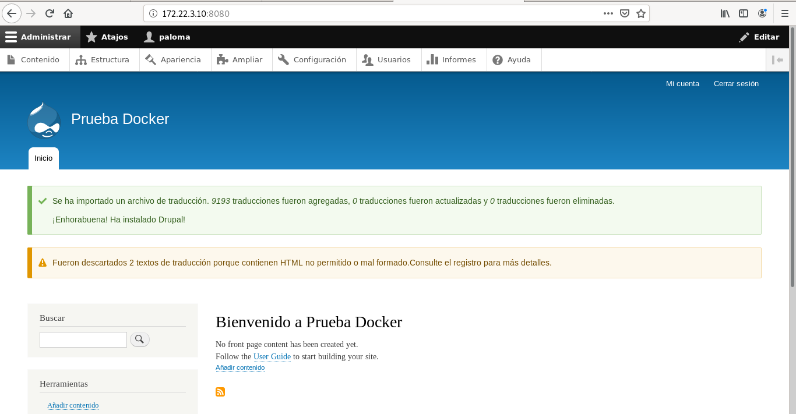

# Implantación de aplicaciones web PHP en docker
Para esta práctica se va crear una máquina desde un [Vagranfile](URL) y se instala **docker.io**:
~~~
vagrant@Docker:~$ sudo apt install docker.io
~~~

## 1. Ejecución de una aplicación web PHP en docker
Queremos ejecutar en un contenedor docker la aplicación web escrita en PHP: [bookMedik](https://github.com/evilnapsis/bookmedik).

En la máquina se clona el repositorio de **bookMedik**:
~~~
vagrant@Docker:~$ git clone https://github.com/evilnapsis/bookmedik
~~~

Se modifica el fichero **/core/controller/Database.php** de la siguiente forma:
~~~
	      function Database(){
		            $this->user=getenv('User_db');$this->pass=getenv('Pass_db');$this->host=getenv('Host_db');$this->ddbb=getenv('Name_db');
    	}
~~~

**Creación del contenedor mariadb y carga de los datos**
En primer lugar, se va a crear una red para la conexión entre contenedores:
~~~
vagrant@Docker:~$ sudo docker network create redbookmedia
2800179b520ec05e2807def790dc177fc1862922ce651b4a7a3c44eca5ca7cef
~~~

Se crea el contenedor de MariaDB:
~~~
vagrant@Docker:~$ sudo docker run -d --name servidor_mysql -v /opt/mysql:/var/lib/mysql -e MYSQL_ROOT_PASSWORD=root -e MYSQL_DATABASE=bookmedik -e MYSQL_USER=paloma -e MYSQL_PASSWORD=paloma --network redbookmedia mariadb
fcf8675aaca384998696a97d5abec662ecff08d19317125796e16e97a4c24410
~~~

Se cargan los datos de **schema.sql** en la base de datos:
~~~
vagrant@Docker:~/bookmedik$ sudo docker exec -i servidor_mysql /usr/bin/mysql -u paloma --password=paloma bookmedik < schema.sql
~~~

De esta forma se ve como se ha creado y cargado la base de datos:
~~~
vagrant@Docker:~/bookmedik$ sudo ls /opt/mysql/bookmedik/
category.frm  medic.frm    pacient.ibd	reservation.frm  status.ibd
category.ibd  medic.ibd    payment.frm	reservation.ibd  user.frm
db.opt	      pacient.frm  payment.ibd	status.frm	 user.ibd
~~~

**Creación del contenedor con la aplicación web**
Para copiar el direcotrio **bookmedik** en el VirtualRoot se configura un Dockerfile:
~~~
FROM debian
RUN apt update \
    && apt install -y apache2 libapache2-mod-php php php-mysql \
    && rm /var/www/html/index.html
ENV User_db=paloma
ENV Pass_db=paloma
ENV Name_db=bookmedik
ENV Host_db=servidor_mysql
COPY ./bookmedik /var/www/html
CMD ["/usr/sbin/apache2ctl", "-D", "FOREGROUND"]
~~~

Se sube la imagen a DockerHub. Primero hay que loguearse:
~~~
vagrant@Docker:~$ sudo docker login
Login with your Docker ID to push and pull images from Docker Hub. If you don't have a Docker ID, head over to https://hub.docker.com to create one.
Username: palomar88
Password: 
WARNING! Your password will be stored unencrypted in /root/.docker/config.json.
Configure a credential helper to remove this warning. See
https://docs.docker.com/engine/reference/commandline/login/#credentials-store

Login Succeeded
~~~

Se crea la imagen:
~~~
vagrant@Docker:~$ sudo docker build -t palomar88/bookmedik:v1 .
Sending build context to Docker daemon  5.804MB
Step 1/8 : FROM debian
latest: Pulling from library/debian
50e431f79093: Pull complete 
Digest: sha256:a63d0b2ecbd723da612abf0a8bdb594ee78f18f691d7dc652ac305a490c9b71a
Status: Downloaded newer image for debian:latest
 ---> 971452c94376
Step 2/8 : RUN apt update     && apt install -y apache2 libapache2-mod-php php php-mysql     && rm /var/www/html/index.html
 ---> Running in 836761e0e5b8
...
~~~

Y se sube a DocherHub:
~~~
vagrant@Docker:~$ sudo docker push palomar88/bookmedik:v1
The push refers to repository [docker.io/palomar88/bookmedik]
542ae4449716: Pushed 
cfca6beab3ae: Pushed 
1c76bd0dc325: Mounted from library/debian 
v1: digest: sha256:cb450884816cbad128fbe6a6e16b81ffec94503e7604ba18cda2c4ea12f1ab9a size: 952
~~~

Y se inicia el contenedor con la imagen creada:
~~~
vagrant@Docker:~$ sudo docker run -d --name apache -v /opt/apache2/:/var/log/apache2/ -p 8080:80 --network redbookmedia palomar88/bookmedik:v1
42f0f14ba0eb3476aeb38be5f9b42a058f5326c3f531b2af4aaf1c62224f22d7
~~~

> Comprobación:

**Comprueba que si borramos el contenedor mariadb y volvemos a crear otro, los datos no se han perdido porque se han guardado en un volumen**

Se crea una consulta de prueba:

Se borra el contenedor:
~~~
vagrant@Docker:~/bookmedik$ sudo docker ps -a
CONTAINER ID        IMAGE                    COMMAND                  CREATED             STATUS              PORTS                  NAMES
42f0f14ba0eb        palomar88/bookmedik:v1   "/usr/sbin/apache2ct…"   6 minutes ago       Up 6 minutes        0.0.0.0:8080->80/tcp   apache
fcf8675aaca3        mariadb                  "docker-entrypoint.s…"   About an hour ago   Up About an hour    3306/tcp               servidor_mysql
vagrant@Docker:~/bookmedik$ sudo docker rm -f fcf8675aaca3
fcf8675aaca3
vagrant@Docker:~/bookmedik$ sudo docker ps -a
CONTAINER ID        IMAGE                    COMMAND                  CREATED             STATUS              PORTS                  NAMES
42f0f14ba0eb        palomar88/bookmedik:v1   "/usr/sbin/apache2ct…"   7 minutes ago       Up 7 minutes        0.0.0.0:8080->80/tcp   apache
~~~

Se observa como desaparece la información de las citas:

Se vuelve a crear el contenedor:
~~~
vagrant@Docker:~/bookmedik$ sudo docker run -d --name servidor_mysql -v /opt/mysql:/var/lib/mysql -e MYSQL_ROOT_PASSWORD=root -e MYSQL_DATABASE=bookmedik -e MYSQL_USER=paloma -e MYSQL_PASSWORD=paloma --network redbookmedia mariadb
a0955d01c9e8996e9c8b9d2b90a5c74d34583404b333f5d5978abb7dbc3811
~~~

Y se comprueba que los datos vuelven a estar disponibles:

## 2. Ejecución de una aplicación web PHP en docker
Realiza la imagen docker de la aplicación a partir de la imagen oficial [PHP](https://hub.docker.com/_/php/) que encuentras en docker hub. Lee la documentación de la imagen para configurar una imagen con apache2 y php, además seguramente tengas que instalar alguna extensión de php. Crea esta imagen en docker hub.

Crea un script con docker compose que levante el escenario con los dos contenedores.

**Documenta como has creado el Dockerfile para crear la imagen, entrega la URL del repositorio github donde has guardado el contexto para a creación de la imagen**

Se crea un **Dockerfile** con la siguiente información:
~~~
FROM php:7.4-apache
RUN docker-php-ext-install pdo pdo_mysql mysqli
ENV User_db=paloma
ENV Pass_db=paloma
ENV Name_db=bookmedik
ENV Host_db=servidor_mysql
ENV APACHE_DOCUMENT_ROOT /var/www/html
COPY ./bookmedik /var/www/html
CMD ["apache2ctl", "-D", "FOREGROUND"]
~~~

Y se crea la imagen:
~~~
vagrant@Docker:~/php$ sudo docker build -t palomar88/bookmedik-php:v2 .

Sending build context to Docker daemon  5.773MB
Step 1/7 : FROM php:7.4-apache
 ---> b68dc3a232b4
Step 2/7 : ENV User_db=paloma
 ---> Using cache
 ---> d15f951d07ab
Step 3/7 : ENV Pass_db=paloma
 ---> Using cache
 ---> 16018a569014
Step 4/7 : ENV Name_db=bookmedik
 ---> Using cache
 ---> a0acc48fe1da
Step 5/7 : ENV Host_db=servidor_mysql
 ---> Using cache
 ---> 64710a2bffd3
Step 6/7 : COPY ./bookmedik /var/www/html
 ---> 891751265e8d
Step 7/7 : CMD ["/usr/sbin/apache2ctl", "-D", "FOREGROUND"]
 ---> Running in c6fd29ea991b
Removing intermediate container c6fd29ea991b
 ---> 688139e35d01
Successfully built 688139e35d01
Successfully tagged palomar88/bookmedik-php:v1
...
~~~

Se incia el contenedor:
~~~
vagrant@Docker:~/php$ sudo docker run -d --name apache -p 8080:80 --network redbookmedia palomar88/bookmedik-php:v1
ad2ac4275e1fee0f3c878a5adf05c4079cecdbc85b87c7f0f361393a8d4cf970
~~~

> Comprobación:

**Docuementa el uso de docker compose, entrega el script que has desarrollado**

El Docker-Compose se crea de la siguiente forma:
~~~
version: '3.1'

services:
  apache:
    image: palomar88/bookmedik-php:v2
    restart: always
    links:
      - servidor_mysql:mysql
    ports:
      - 8080:80 
  servidor_mysql:
    image: mariadb
    restart: always
    environment:
      MYSQL_ROOT_PASSWORD: root
      MYSQL_DATABASE: bookmedik
      MYSQL_USER: paloma
      MYSQL_PASSWORD: paloma
    volumes:
      - /opt/mysql:/var/lib/mysql
~~~

Se crea el fichero creado docker-compose:
~~~
vagrant@Docker:~/php$ sudo docker-compose -f docker-compose.yml up
Creating network "php_default" with the default driver
Creating php_bookmedik_1 ... done
Creating php_apache_1    ... done
Attaching to php_bookmedik_1, php_apache_1
bookmedik_1  | 2020-02-27 08:47:14+00:00 [Note] [Entrypoint]: Entrypoint script for MySQL Server 1:10.4.12+maria~bionic started.
...
~~~

## 3. Ejecución de una aplicación PHP en docker

En este caso queremos usar un contenedor que utilice nginx para servir la aplicación PHP. Puedes crear la imagen desde una imagen base debian o ubuntu o desde la imagen oficial de nginx. Vamos a crear otro contenedor que sirva php-fpm.Y finalmente nuestro contenedor con la aplicación. Crea un script con docker compose que levante el escenario con los tres contenedores.

A lo mejor te puede ayudar el siguiente enlace: [Dockerise your PHP application with Nginx and PHP7-FPM](http://geekyplatypus.com/dockerise-your-php-application-with-nginx-and-php7-fpm/)

**Documenta el proceso que has realizado para crear el escenario. Entrega el script de docker compose y realiza alguna prueba de funcionamiento.**

## 4. Ejecución de un CMS en docker
A partir de una imagen base (que no sea una imagen con el CMS), genera una imagen que despliegue un CMS PHP (que no sea wordpress). El contenedor que se crea a partir de esta imagen se tendrá que enlazar con un contenedor mariadb o postgreSQL.

Crea los volúmenes necesarios para que la información que se guarda sea persistente.

Elige un CMS PHP y crea la imagen que despliega la aplicación. Crea los contenedores necesarios para servir el CMS. Entrega una prueba de funcionamiento.

Se descarga el CMS Joomla:
~~~
vagrant@Docker:~/joomla$ sudo wget https://www.drupal.org/download-latest/zip
~~~

Se crea un contenedor con la base de datps:
~~~
vagrant@Docker:~/joomla$ sudo docker run -d --name servidor_mysql -v /opt/mysql:/var/lib/mysql -e MYSQL_ROOT_PASSWORD=root -e MYSQL_DATABASE=joomla -e MYSQL_USER=paloma -e  MYSQL_PASSWORD=paloma --network redbookmedia mariadb
ce8d117e0991155117c228e4b640f57b075e90de138e628ffba3a504d1892ae0
~~~

El Dockerfile para el contendor de joomla es el siguiente:
~~~
FROM php:7.4-apache
RUN sudo apt install php7.3 php7.3-mysql libapache2-mod-php php-gd php-mysql php-xml php-mbstring && docker-php-ext-install pdo pdo_mysql mysqli
ENV User_db=paloma
ENV Pass_db=paloma
ENV Name_db=joomla
ENV Host_db=servidor_mysql
ENV APACHE_DOCUMENT_ROOT /var/www/html
COPY ./drupal-8.8.2 /var/www/html
CMD ["apache2ctl", "-D", "FOREGROUND"]
~~~

Se sube la imagen a DockerHub:
~~~
vagrant@Docker:~/joomla$ sudo docker build -t palomar88/joomla:v1 .
Sending build context to Docker daemon  121.9MB
Step 1/9 : FROM php:7.4-apache
 ---> b68dc3a232b4
Step 2/9 : RUN sudo apt install php7.3 php7.3-mysql libapache2-mod-php php-gd php-mysql php-xml php-mbstring && docker-php-ext-install pdo pdo_mysql mysqli
 ---> Running in cd4db50f3b8e
/bin/sh: 1: sudo: not found
The command '/bin/sh -c sudo apt install php7.3 php7.3-mysql libapache2-mod-php php-gd php-mysql php-xml php-mbstring && docker-php-ext-install pdo pdo_mysql mysqli' returned a non-zero code: 127
~~~

Y se crea el cont
sudo docker run -d --name joomla -p 8080:80 --network redbookmedia -v /opt/mysql:/var/lib/mysql palomar88/joomla:v1

**Elimina los contenedores, vuelve a crearlos y demuestra que la información no se ha perdido.**

## 5. Ejecución de un CMS en docker
Busca una imagen oficial de un CMS PHP en docker hub (distinto al que has instalado en la tarea anterior, ni wordpress), y crea los contenedores necesarios para servir el CMS, siguiendo la documentación de docker hub.

**Explica el proceso que has seguido para realizar la tarea, pon alguna prueba de funcionamiento. ¿Se ha creado algún volumen para que la información sea persistente?**

Se va a instalar el CMS Drupal siguiendo la [documentación oficial de Docker Hub](https://hub.docker.com/_/drupal). Para ello se va a crear un fichero, docker-compose.yml para crear un contenedor con drupal y otro con la base de datos Postgres:
~~~
version: '3.1'

services:

  drupal:
    image: drupal:8-apache
    ports:
      - 8080:80
    volumes:
      - /var/www/html/modules
      - /var/www/html/profiles
      - /var/www/html/themes
      # this takes advantage of the feature in Docker that a new anonymous
      # volume (which is what we're creating here) will be initialized with the
      # existing content of the image at the same location
      - /var/www/html/sites
    restart: always

  postgres:
    image: postgres:10
    environment:
      POSTGRES_PASSWORD: example
    restart: always
~~~

Y se crean los contenedores:
~~~
root@Docker:/home/vagrant# docker-compose -f docker-compose.yml up
Creating network "vagrant_default" with the default driver
Creating drupal_db       ... done
Creating servidor_drupal ... done
Attaching to servidor_drupal, drupal_db
...
~~~

Se comienza la instalación:

Se introduce las variables que se indica en Docker Hub para la base de datos:

Y así se termina la isntalación de drupal:

